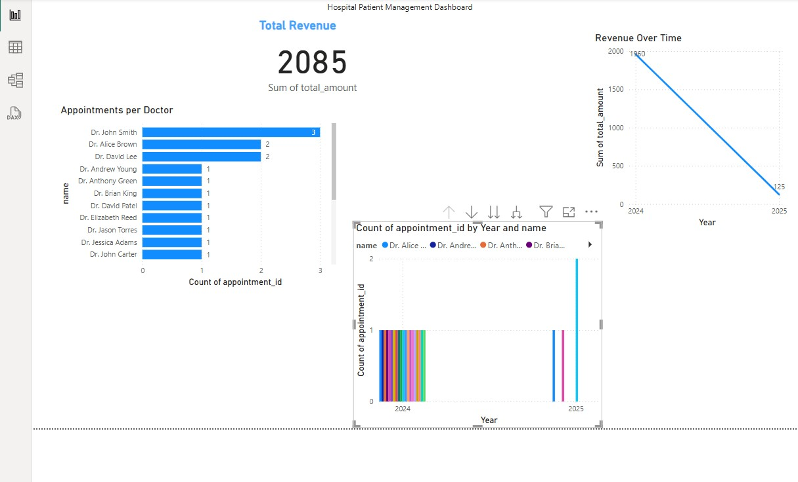

# Hospital Patient Management — SQL + Power BI

This project demonstrates a simple **Hospital Patient Management System** built with **SQL** and **Power BI**.  
It includes a normalized database schema, realistic sample data, and an interactive dashboard showcasing key hospital metrics.

## 📊 Dashboard Preview

## 🚀 Files Included
- `schema.sql` — SQL script to create tables
- `data.sql` — SQL script to insert sample data
- `queries.sql` — Sample SQL queries
- `Visualisations PowerBi.pbix` — Power BI dashboard file
- `CSV` — Exported CSV files for Power BI
- `Visualisation SS.jpg` — Dashboard image

## 🔷 How to Use
1. Run `schema.sql` and `data.sql` in your SQL client to create and populate the database.
2. Export the tables as CSVs (or use the provided ones).
3. Open `Visualisations PowerBi.pbix` in Power BI Desktop to view the dashboard.

---
